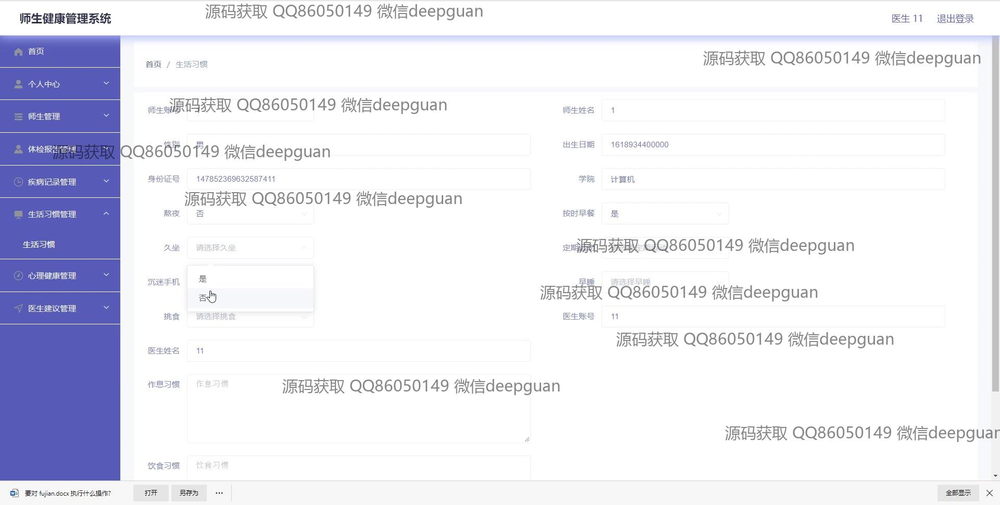

<h1 align="center">楚师师生健康管理系统设计与实现+vue</h1>

## 简介
师生健康管理系统：角色分为医生、健身教练、管理员和用户；功能涵盖个人中心、师生管理、体检报告、疾病记录、生活习惯与心理健康管理等。    --计算机毕业设计源码；毕设源码；java毕业设计源码

## 联系方式

<h3 align="center">获取完整代码与数据库文件 + 微信：deepguan QQ: 86050149 QQ群: 783742310</h3>

<h3 align="center">可帮忙远程部署 包运行成功！提供远程部署、修改代码、设计文档指导、代码讲解等服务！</h3>

## 功能介绍（完整见运行截图）
管理员：管理员可以进行用户信息管理，包括新增、修改和删除用户账户，并查看用户的健康数据；权限设置允许添加、编辑和删除系统的内容模块；生成并查看系统日志，确保系统安全和性能监控；提供通过导航菜单管理个人中心、师生管理、体检报告、病史记录、心理健康和医生建议等不同健康模块。

教师/教练：教师和教练可以管理个人账户信息，编辑和上传资质证明等资料；查看和管理学生的健康信息，提供个性化的健身和健康建议；记录学生的心理健康状态，管理生活习惯信息，并提供反馈；使用系统提供的工具，生成相应的健康报告和分析结果，用于日常教学和服务。

学生：学生可以访问和管理个人账户信息，更新健康档案；查看体检报告和历史疾病记录，便于自主掌握健康状况；在个人中心查看心理健康评估结果和生活习惯管理建议；根据医生和教练的建议进行针对性调理，并可以浏览相关健康教育内容。

医生：医生能够管理个人资料和诊断信息，与学生一起维护健康档案；通过系统工具进行师生健康信息的分析，提供专业医疗建议；管理体检报告和疾病记录，协助进行风险评估与预防措施的制定；在模块中编辑与跟踪病史信息，参与学生的健康管理活动。

## 运行截图

本代码来源于网络,仅供学习参考使用!

